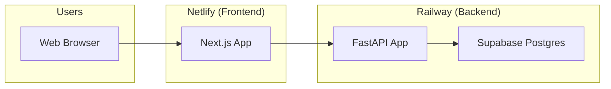

# Deployment

Railway (backend) and Netlify (frontend) deployment configuration.

## Architecture



## Backend deployment (Railway)

### Configuration
- **File**: `railway.toml`
- **Builder**: Nixpacks
- **Runtime**: Python 3.11
- **Process**: `uvicorn app.main:app`

### Build process
```bash
pip install uv && uv sync --no-dev
```

### Start command
```bash
uvicorn app.main:app --host 0.0.0.0 --port $PORT
```

### Health check
```bash
GET /health
```

### Environment variables
Set in Railway dashboard:
- `SUPABASE_URL`
- `SUPABASE_SECRET_KEY`
- `SUPABASE_PUBLISHABLE_KEY`
- `SUPABASE_JWT_SECRET`
- `ENVIRONMENT=production`
- `FRONTEND_URL` - Netlify URL
- `CORS_ORIGINS_RAW` - Netlify URL
- `GEMINI_API_KEY` - Required for LLM

### Deployment steps
1. Connect GitHub repo to Railway
2. Set environment variables
3. Deploy automatically on push to `main`

## Frontend deployment (Netlify)

### Configuration
- **File**: `netlify.toml`
- **Base**: `web/`
- **Build**: `npm install && npm run build`
- **Publish**: `.next`
- **Plugin**: `@netlify/plugin-nextjs`

### Node version
- **Version**: 20

### Environment variables
Set in Netlify dashboard:
- `NEXT_PUBLIC_API_BASE_URL` - Railway URL
- `NEXT_PUBLIC_SUPABASE_URL`
- `NEXT_PUBLIC_SUPABASE_PUBLISHABLE_KEY`

### Deployment steps
1. Connect GitHub repo to Netlify
2. Set base directory to `web/`
3. Set environment variables
4. Deploy automatically on push to `main`

## Cross-origin wiring

### After first deploys
1. Copy Railway service URL to Netlify's `NEXT_PUBLIC_API_BASE_URL`
2. Copy Netlify site URL to Railway's `FRONTEND_URL` and `CORS_ORIGINS_RAW`
3. Redeploy both services

### CORS configuration
- `FRONTEND_URL` - Used for password reset redirects
- `CORS_ORIGINS_RAW` - Comma-separated allowed origins

## Critical warning

**Do NOT add a root `package.json`**

Nixpacks detects providers by marker files. A root `package.json` causes Nixpacks to pick Node.js instead of Python, breaking the backend build.

All JS/Node config must live under `web/`.

## Environment setup

### Railway variables
```bash
# Required
SUPABASE_URL=https://xxxxx.supabase.co
SUPABASE_SECRET_KEY=your_key
SUPABASE_PUBLISHABLE_KEY=your_key
SUPABASE_JWT_SECRET=your_secret
ENVIRONMENT=production
FRONTEND_URL=https://your-netlify-site.netlify.app
CORS_ORIGINS_RAW=https://your-netlify-site.netlify.app
GEMINI_API_KEY=your_key

# Optional
LLM_PROVIDER=gemini
ENCRYPTION_KEY=your_key
STRIPE_SECRET_KEY=your_key
```

### Netlify variables
```bash
NEXT_PUBLIC_API_BASE_URL=https://your-railway-service.up.railway.app
NEXT_PUBLIC_SUPABASE_URL=https://xxxxx.supabase.co
NEXT_PUBLIC_SUPABASE_PUBLISHABLE_KEY=your_key
```

## Monitoring

### Railway
- Deployment logs
- Health check status
- Resource usage

### Netlify
- Build logs
- Function logs
- Performance metrics

## Rollback

### Railway
1. Go to deployment history
2. Select previous deployment
3. Click "Rollback"

### Netlify
1. Go to deploys
2. Find working deploy
3. Click "Publish"

## Troubleshooting

### Backend won't start
- Check environment variables
- Verify Supabase credentials
- Check build logs

### Frontend won't build
- Check `NEXT_PUBLIC_API_BASE_URL`
- Verify Node.js version
- Check build logs

### CORS errors
- Verify `CORS_ORIGINS_RAW` includes frontend URL
- Check `FRONTEND_URL` is correct
- Redeploy both services

---

*360 Flatmates Platform Documentation*
