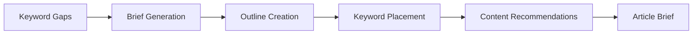

# Articles Agent

Generates SEO article briefs from identified content gaps and keyword opportunities.

## Purpose

The Articles Agent creates detailed article briefs for content creators, based on keyword gaps identified by SEO and GEO agents. It produces structured outlines with target keywords, headings, and content recommendations.

## How it works



### Processing pipeline

1. **Gap analysis** - Identifies content opportunities from SEO/GEO data
2. **Brief generation** - Creates article structure and outline
3. **Keyword integration** - Places target keywords strategically
4. **Recommendation addition** - Adds content creation guidelines
5. **Brief storage** - Saves brief for content creators

## Key abstractions

| Component | Location | Purpose |
|-----------|----------|---------|
| `ArticlesAgent` | `app/services/agents/articles_agent.py` | Main agent orchestrator |
| `ContentBriefGenerator` | Service component | Brief creation logic |

## Integration points

### Inputs
- Keyword gaps from SEO Agent
- Visibility gaps from GEO Agent
- Brand voice from Brand Brain

### Outputs
- Article briefs with outlines
- Target keyword lists
- Content recommendations
- Publishing suggestions

### Consumers
- **Content Studio** - Displays article briefs
- **Content creators** - Uses briefs for writing

## Configuration

### Brief settings
- `ARTICLE_LENGTH` - Target word count (default: 1500)
- `KEYWORD_DENSITY` - Target keyword density (default: 1-2%)
- `HEADLINE_COUNT` - Number of H2/H3 headings (default: 5-8)

### Content types
- Blog posts
- How-to guides
- Comparison articles
- Case studies

## Usage examples

### Manual run
1. Go to Content Studio
2. Select "Article Briefs"
3. Click "Generate Briefs"

### API endpoint
```bash
POST /v1/articles/generate
{
  "company_id": 1,
  "content_type": "blog_post"
}
```

## Performance

- **Generation time**: 10-30 seconds per brief
- **Briefs per run**: 5-20
- **Quality**: Depends on LLM provider

## Limitations

- Briefs require human review and editing
- Cannot guarantee content performance
- LLM-generated content needs fact-checking
- Limited by available keyword data

---

*360 Flatmates Platform Documentation*
