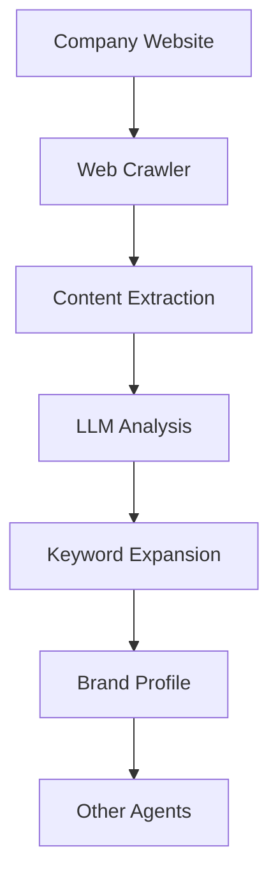

# Brand Brain

Analyzes company websites, extracts product intelligence, and builds keyword universes for targeted marketing.

## Purpose

Brand Brain is the foundation of the multi-agent system. It crawls company websites, analyzes content, and builds comprehensive intelligence profiles that feed all other agents. Without Brand Brain, agents lack the context needed to find relevant opportunities.

## How it works



### Processing pipeline

1. **Web crawling** - Fetches and parses website content
2. **Content extraction** - Identifies key pages, products, and messaging
3. **LLM analysis** - Uses AI to understand business domain and value proposition
4. **Keyword expansion** - Generates keyword universe from analysis
5. **Profile creation** - Stores comprehensive brand intelligence

## Key abstractions

| Component | Location | Purpose |
|-----------|----------|---------|
| `BrandBrain` | `app/services/product/brand_brain.py` | Main orchestrator class |
| `BrandBrainCrawler` | `app/services/product/brand_brain_crawler.py` | Web crawling with rate limiting |
| `WebsiteAnalyzer` | `app/services/product/copilot/analyzer.py` | Content analysis |
| `KeywordExpansionService` | `app/services/product/keyword_expansion.py` | Keyword universe generation |

## Integration points

### Inputs
- Company website URL
- Manual brand description (fallback)

### Outputs
- Brand profile (product, audience, voice)
- Keyword universe (primary, secondary, long-tail)
- Business domain classification
- Tone and voice characteristics

### Consumers
- **Reddit Agent** - Uses keywords for post discovery
- **SEO Agent** - Uses brand context for audit
- **GEO Agent** - Uses keywords for visibility scoring
- **Content Agents** - Uses voice for content generation

## Configuration

### Environment variables
- `GEMINI_API_KEY` - LLM for analysis (default provider)
- `BRAND_CRAWL_RATE_LIMIT` - Seconds between requests (default: 1.0)

### Brand profile fields
- `brand_name` - Company name
- `summary` - Business description
- `products` - Product list
- `audience` - Target audience
- `voice_notes` - Writing style guidelines
- `call_to_action` - Preferred CTA style

## Usage examples

### Programmatic usage
```python
from app.services.product.brand_brain import BrandBrain

brain = BrandBrain()
profile = brain.analyze("https://example.com")
print(profile.keywords)  # Generated keyword universe
```

### API endpoint
```bash
POST /v1/company/analyze
{
  "website_url": "https://example.com"
}
```

### Dashboard
1. Go to Company page
2. Enter website URL
3. Click "Analyze"
4. Review generated brand profile

## Performance

- **Crawl time**: 10-30 seconds depending on site size
- **Analysis time**: 5-15 seconds with LLM
- **Keyword generation**: 2-5 seconds
- **Total**: 20-50 seconds for complete analysis

## Limitations

- Requires accessible website (no login walls)
- Limited by robots.txt restrictions
- LLM analysis quality depends on provider
- Keyword expansion is heuristic-based

---

*360 Flatmates Platform Documentation*
