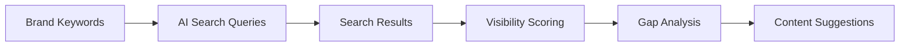

# GEO Agent

Scores AI search visibility readiness and suggests content gaps for generative search engines.

## Purpose

The GEO Agent evaluates how well your brand appears in AI-powered search engines (like Google AI Overviews, Bing Chat, Perplexity). It identifies gaps where your content could be cited or recommended by AI systems.

## How it works



### Processing pipeline

1. **Query generation** - Creates AI search queries from brand context
2. **Search execution** - Queries AI search engines
3. **Result analysis** - Evaluates brand presence in results
4. **Visibility scoring** - Scores AI search readiness
5. **Gap identification** - Finds content opportunities

## Key abstractions

| Component | Location | Purpose |
|-----------|----------|---------|
| `GEOAgent` | `app/services/agents/geo_agent.py` | Main agent orchestrator |
| `VisibilityEngine` | `app/services/product/visibility.py` | Visibility scoring |

## Integration points

### Inputs
- Brand keywords and products
- Business domain
- Target topics

### Outputs
- AI visibility score
- Citation opportunities
- Content gap analysis
- Improvement recommendations

### Consumers
- **GEO Dashboard** - Displays visibility metrics
- **Articles Agent** - Uses gaps for content briefs
- **Brand Brain** - Updates keyword universe

## Configuration

### Search providers
- Perplexity (primary)
- Google AI Overviews (if available)
- Bing Chat (if available)

### Scoring factors
- Brand mentions in AI responses
- Citation frequency
- Content relevance scores
- Competitor comparison

## Usage examples

### Manual run
1. Go to GEO Dashboard
2. Click "Run GEO Analysis"
3. Review visibility scores

### API endpoint
```bash
POST /v1/geo/analyze
{
  "company_id": 1
}
```

## Performance

- **Analysis time**: 2-5 minutes
- **Queries executed**: 10-50
- **Results analyzed**: 50-200

## Limitations

- Depends on AI search engine availability
- Limited by API rate limits
- Cannot guarantee future AI behavior
- Visibility scores are relative, not absolute

---

*360 Flatmates Platform Documentation*
