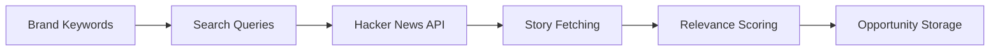

# Hacker News Agent

Monitors Hacker News for technical and product discussions relevant to your brand.

## Purpose

The Hacker News Agent tracks discussions on Hacker News, a community focused on technology and startups. It identifies opportunities where your brand can provide technical expertise or product insights.

## How it works



### Processing pipeline

1. **Query building** - Generates technical search queries from brand context
2. **Story fetching** - Fetches stories via Hacker News API
3. **Comment analysis** - Analyzes comment threads for opportunities
4. **Relevance scoring** - Applies technical relevance scoring
5. **Opportunity storage** - Saves relevant discussions

## Key abstractions

| Component | Location | Purpose |
|-----------|----------|---------|
| `HackerNewsAgent` | `app/services/agents/hackernews_agent.py` | Main agent orchestrator |
| `RelevanceEngine` | `app/services/product/relevance_v2.py` | Scoring algorithm |

## Integration points

### Inputs
- Brand keywords and technical context
- Business domain classification
- Relevance thresholds

### Outputs
- Technical discussion opportunities
- Comment thread insights
- Agent run metrics

### Consumers
- **Central Feed** - Displays HN opportunities
- **Technical SEO Agent** - Uses technical insights

## Configuration

### Scoring adjustments
- Higher weight for technical keywords
- Bonus for Show HN posts
- Penalty for job postings

## Usage examples

### Manual run
1. Go to Agent Runs page
2. Select Hacker News Agent
3. Click "Run"

### Scheduled runs
```bash
python -m app.services.infrastructure.scheduler.cli --company-id 1 --agent hackernews
```

## Performance

- **Stories fetched**: 20-100 per run
- **Processing time**: 15-60 seconds
- **Success rate**: 5-15% kept

## Limitations

- Uses official Hacker News API (free, no auth required)
- Limited to recent stories (24-48 hours)
- Cannot access private or restricted content

---

*360 Flatmates Platform Documentation*
