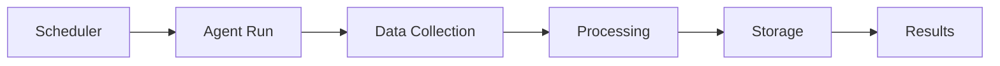

# Features

Multi-agent platform for AI-powered marketing and community engagement.

## Overview

Social AI Reply uses a multi-agent architecture where specialized agents handle different marketing channels and tasks. Each agent focuses on a specific domain, from discovering Reddit opportunities to generating SEO content briefs.

## Agent categories

### Discovery agents
Find relevant opportunities across social platforms:
- [Reddit Agent](reddit-agent.md) - Discovers relevant Reddit posts
- [Hacker News Agent](hackernews-agent.md) - Monitors HN for discussions

### Analysis agents
Analyze websites and content for optimization:
- [Brand Brain](brand-brain.md) - Extracts product intelligence from websites
- [SEO Agent](seo-agent.md) - Finds SEO issues and keyword gaps
- [GEO Agent](geo-agent.md) - Scores AI search visibility readiness
- [Technical SEO Agent](technical-seo-agent.md) - Code-level website audits

### Content agents
Generate content ideas and briefs:
- [Articles Agent](articles-agent.md) - Creates SEO article briefs
- [X Agent](x-agent.md) - Generates X/Twitter content ideas
- [LinkedIn Agent](linkedin-agent.md) - Creates professional post ideas
- [UGC Agent](ugc-agent.md) - Produces short video briefs

## How agents work

### Agent lifecycle

### Agent configuration
- **Manual runs**: Triggered from the dashboard
- **Daily schedule**: Automated daily runs
- **Cron jobs**: Custom scheduling via cron expressions

### Agent results
Each agent run produces:
- **Opportunities** - Relevant posts or issues found
- **Briefs** - Content suggestions or analysis
- **Metrics** - Performance data and scoring

## Core capabilities

### Multi-platform support
- Reddit (primary focus)
- Hacker News
- X/Twitter (manual mode)
- LinkedIn (manual mode)

### Transparent scoring
Every opportunity shows:
- `reason_relevant` - Why it was kept
- `rejection_reason` - Why it was rejected (in debug mode)
- Weighted scoring breakdown

### Learning system
The feedback loop learns from:
- User approvals/rejections
- Keyword weight adjustments
- Scoring calibration

## Agent coordination

### Central feed
All agent results feed into a central opportunity feed for unified management.

### Cross-agent insights
Agents can share data:
- Brand Brain feeds keyword intelligence to other agents
- Relevance engine uses consistent scoring across agents
- Scheduler coordinates agent execution

## Performance characteristics

### Scalability
- Agents run independently
- Parallel execution supported
- Database-backed state management

### Resource usage
- LLM calls for analysis and generation
- HTTP requests for data collection
- Local embeddings for scoring (TF-IDF)

### Rate limiting
- Per-platform request limits
- Circuit breaker for failures
- Graceful degradation

---

*360 Flatmates Platform Documentation*
