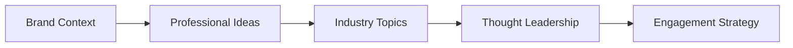

# LinkedIn Agent

Generates professional LinkedIn post ideas for B2B engagement and thought leadership.

## Purpose

The LinkedIn Agent creates professional content ideas for LinkedIn engagement. Like the X Agent, it operates in manual mode because LinkedIn's free APIs are unreliable, generating suggestions for manual posting.

## How it works



### Processing pipeline

1. **Context analysis** - Uses brand profile and industry focus
2. **Idea generation** - Creates professional post ideas
3. **Topic identification** - Finds relevant industry discussions
4. **Thought leadership** - Generates expert commentary ideas
5. **Strategy delivery** - Provides engagement recommendations

## Key abstractions

| Component | Location | Purpose |
|-----------|----------|---------|
| `LinkedInAgent` | `app/services/agents/linkedin_agent.py` | Main agent orchestrator |
| `ProfessionalContentGenerator` | Service component | Post idea generation |

## Integration points

### Inputs
- Brand profile and industry
- Professional expertise areas
- Company updates and milestones

### Outputs
- Post ideas and outlines
- Article summaries
- Industry commentary suggestions
- Network engagement strategies

### Consumers
- **Content Studio** - Displays LinkedIn ideas
- **Manual posting** - Users create posts manually

## Configuration

### Content types
- Text posts
- Article shares
- Company updates
- Industry commentary

### Professional tone
- Authoritative voice
- Data-driven insights
- Practical advice
- Industry trends

## Usage examples

### Manual run
1. Go to Content Studio
2. Select "LinkedIn"
3. Click "Generate Ideas"

### API endpoint
```bash
POST /v1/linkedin/generate
{
  "company_id": 1,
  "content_type": "text_post"
}
```

## Performance

- **Generation time**: 5-15 seconds
- **Ideas per run**: 10-20
- **Quality**: Depends on LLM provider

## Limitations

- Manual mode only (no live API fetching)
- Cannot track engagement metrics
- Ideas require human judgment
- Professional context needs manual input

---

*360 Flatmates Platform Documentation*
