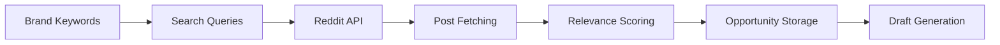

# Reddit Agent

Discovers relevant Reddit posts using free public APIs and scores them with the relevance engine.

## Purpose

The Reddit Agent is the primary discovery agent, finding opportunities across Reddit's vast ecosystem of discussions. It uses free public APIs to fetch posts, applies the relevance engine to score them, and stores high-quality opportunities for manual engagement.

## How it works



### Processing pipeline

1. **Query building** - Generates search queries from brand keywords
2. **Post fetching** - Fetches candidates via Reddit public JSON API
3. **Deduplication** - Removes duplicates by URL and title similarity
4. **Relevance scoring** - Applies weighted scoring formula
5. **Opportunity storage** - Saves kept opportunities to database
6. **Draft generation** - Creates reply drafts for high-score opportunities

## Key abstractions

| Component | Location | Purpose |
|-----------|----------|---------|
| `RedditAgent` | `app/services/agents/reddit_agent.py` | Main agent orchestrator |
| `RedditDiscoveryService` | `app/services/product/reddit_discovery.py` | Reddit API interaction |
| `RelevanceEngine` | `app/services/product/relevance_v2.py` | Scoring algorithm |
| `EmbeddingService` | `app/services/infrastructure/embeddings/` | Semantic similarity |

## Integration points

### Inputs
- Brand keywords from Brand Brain
- Monitored subreddits configuration
- Relevance thresholds

### Outputs
- Scored opportunities
- Reply drafts
- Agent run metrics

### Consumers
- **Central Feed** - Displays discovered opportunities
- **Copilot** - Generates reply drafts
- **Feedback Loop** - Learns from user actions

## Configuration

### Environment variables
- `REDDIT_USER_AGENT` - User agent for Reddit requests
- `RELEVANCE_THRESHOLD` - Minimum score to keep (default: 70)
- `SEMANTIC_THRESHOLD` - Minimum semantic similarity (default: 0.45)

### Scoring formula
```
score = keyword_score * 0.25
      + semantic_similarity * 0.30
      + intent_score * 0.20
      + pain_point_score * 0.10
      + source_fit_score * 0.10
      + freshness_score * 0.05
```

## Usage examples

### Manual run
1. Go to Agent Runs page
2. Select Reddit Agent
3. Click "Run"
4. View discovered opportunities

### Scheduled runs
```bash
# Run via scheduler CLI
python -m app.services.infrastructure.scheduler.cli --company-id 1 --agent reddit
```

### API endpoint
```bash
POST /v1/agents/reddit/run
{
  "company_id": 1
}
```

## Performance

- **Posts fetched**: 50-200 per run
- **Processing time**: 30-120 seconds
- **Success rate**: 10-30% kept (rest rejected)
- **Rate limiting**: 2 seconds between Reddit requests

## Limitations

- Uses public JSON API (no OAuth required)
- Limited to publicly accessible subreddits
- Cannot fetch deleted or removed posts
- Subject to Reddit rate limits

---

*360 Flatmates Platform Documentation*
