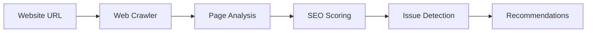

# SEO Agent

Crawls websites and identifies SEO issues, keyword gaps, and optimization opportunities.

## Purpose

The SEO Agent analyzes your website's search engine optimization, finding technical issues, content gaps, and opportunities to improve organic search visibility.

## How it works



### Processing pipeline

1. **Site crawling** - Discovers and fetches website pages
2. **Page analysis** - Analyzes meta tags, content, structure
3. **SEO scoring** - Evaluates search optimization factors
4. **Issue detection** - Identifies technical SEO problems
5. **Recommendation generation** - Creates actionable fix suggestions

## Key abstractions

| Component | Location | Purpose |
|-----------|----------|---------|
| `SEOAgent` | `app/services/agents/seo_agent.py` | Main agent orchestrator |
| `WebCrawler` | Infrastructure service | Website crawling |

## Integration points

### Inputs
- Website URL from Brand Brain
- Target keywords
- Competitor URLs (optional)

### Outputs
- SEO audit report
- Issue list with severity
- Keyword gap analysis
- Optimization recommendations

### Consumers
- **SEO Dashboard** - Displays audit results
- **Articles Agent** - Uses gaps for content ideas
- **Technical SEO Agent** - Deepens code-level analysis

## Configuration

### Crawl settings
- `MAX_PAGES` - Maximum pages to crawl (default: 100)
- `CRAWL_DELAY` - Delay between requests (default: 1.0s)
- `RESPECT_ROBOTS_TXT` - Honor robots.txt (default: true)

### SEO factors analyzed
- Title tags and meta descriptions
- Header structure (H1-H6)
- Image alt text
- Internal linking
- Page speed indicators
- Mobile responsiveness

## Usage examples

### Manual run
1. Go to SEO Dashboard
2. Enter website URL
3. Click "Run SEO Audit"

### API endpoint
```bash
POST /v1/seo/audit
{
  "website_url": "https://example.com"
}
```

## Performance

- **Crawl time**: 1-5 minutes (depends on site size)
- **Analysis time**: 30-120 seconds
- **Pages analyzed**: 10-100

## Limitations

- Requires public website access
- Limited by robots.txt restrictions
- Cannot analyze dynamic content (JavaScript-rendered)
- SEO scoring is heuristic-based

---

*360 Flatmates Platform Documentation*
