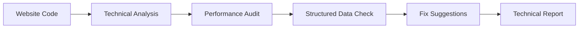

# Technical SEO Agent

Performs code-level website audits with fix suggestions for technical SEO issues.

## Purpose

The Technical SEO Agent analyzes website code and infrastructure for technical SEO problems. It goes beyond content analysis to examine site speed, structured data, crawlability, and other technical factors.

## How it works



### Processing pipeline

1. **Code analysis** - Examines HTML, CSS, JavaScript
2. **Performance audit** - Evaluates loading speed and optimization
3. **Structured data check** - Validates schema markup
4. **Crawlability analysis** - Reviews robots.txt, sitemaps
5. **Fix generation** - Creates actionable technical recommendations

## Key abstractions

| Component | Location | Purpose |
|-----------|----------|---------|
| `TechnicalSEOAgent` | `app/services/agents/technical_seo_agent.py` | Main agent orchestrator |
| `CodeAnalyzer` | Infrastructure service | Code analysis utilities |

## Integration points

### Inputs
- Website URL and codebase
- SEO Agent findings (high-level)
- Brand context

### Outputs
- Technical SEO report
- Code-level fix suggestions
- Performance recommendations
- Implementation guidance

### Consumers
- **Technical SEO Dashboard** - Displays audit results
- **Development team** - Implements fixes

## Configuration

### Analysis areas
- HTML structure and semantics
- CSS optimization
- JavaScript rendering
- Image optimization
- Core Web Vitals
- Schema markup
- Mobile responsiveness

### Fix priorities
- Critical (immediate fix)
- High (fix within week)
- Medium (fix within month)
- Low (when convenient)

## Usage examples

### Manual run
1. Go to Technical SEO Dashboard
2. Enter website URL
3. Click "Run Technical Audit"

### API endpoint
```bash
POST /v1/technical-seo/audit
{
  "website_url": "https://example.com"
}
```

## Performance

- **Analysis time**: 2-5 minutes
- **Code scanned**: HTML, CSS, JavaScript
- **Fixes generated**: 10-50

## Limitations

- Requires access to website code
- Cannot analyze server-side logic
- Limited by website size
- Fixes are suggestions, not automatic

---

*360 Flatmates Platform Documentation*
