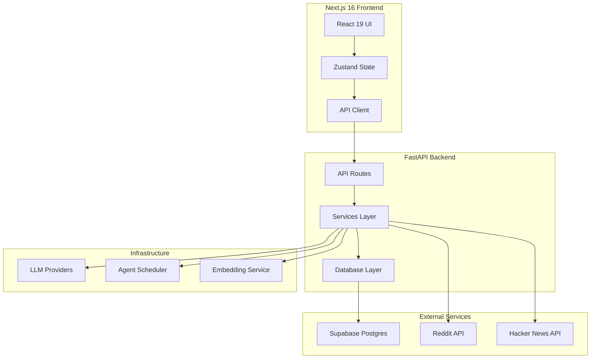
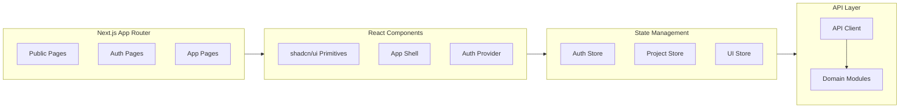
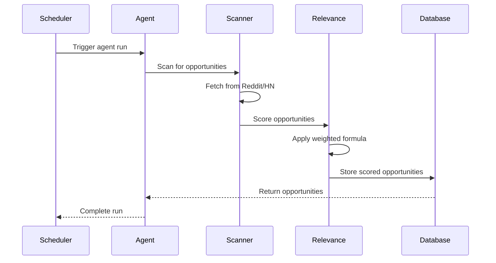
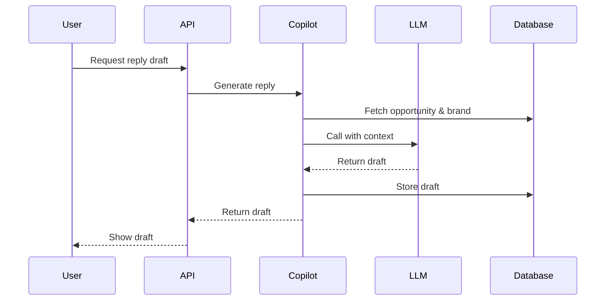
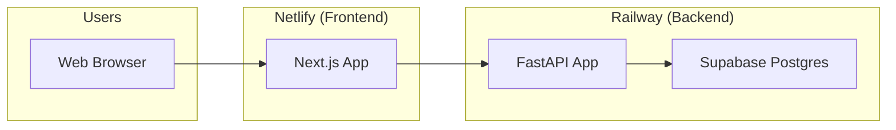

# Architecture

Social AI Reply uses a layered architecture with clear separation between frontend, backend, and infrastructure components.

## System overview

## Backend architecture

The backend follows a clean layered architecture:

### API layer (`app/api/v1/routes/`)
- FastAPI routers organized by domain (auth, projects, discovery, drafts, etc.)
- All routes live under `/v1` prefix
- Handle HTTP request/response, validation, and authentication
- Delegate business logic to services layer

### Services layer (`app/services/`)
- **Product services** (`product/`): Core business logic
  - Pipeline orchestration (scan → opportunity → draft)
  - LLM-driven copilot for reply/post generation
  - Reddit scraping and opportunity detection
  - Relevance scoring and filtering
  - Account safety and posting controls
- **Agent services** (`agents/`): 10 specialized marketing agents
  - Each agent focuses on a specific channel or task
  - Agents run independently via scheduler
- **Infrastructure services** (`infrastructure/`): Technical foundations
  - LLM provider abstraction
  - Embedding service
  - Scheduler and orchestration
  - HTTP budget management

### Database layer (`app/db/`)
- Supabase Postgres via `supabase-py` client
- Table operations organized by domain in `tables/` directory
- Singleton client with FastAPI dependency injection
- No ORM, direct Supabase SDK usage

## Frontend architecture

### Routing
- **Public pages**: Landing, login, register, password reset
- **App pages**: Authenticated routes under `/app/`
- **Shared layout**: App shell with sidebar navigation

### State management
- **Auth store**: JWT token, user info, workspace
- **Project store**: Selected project ID
- **UI store**: Sidebar and notification panel toggles

### Styling
- Tailwind CSS v4 with design tokens
- shadcn/ui components built on `@base-ui/react`
- Class variance authority for component variants

## Data flow

### Opportunity discovery flow

### Reply generation flow

## Key abstractions

| Component | Location | Purpose |
|-----------|----------|---------|
| `LLMService` | `app/services/infrastructure/llm/service.py` | Unified facade for LLM operations |
| `VisibilityRunner` | `app/services/infrastructure/llm/service.py` | Multi-provider prompt execution |
| `RelevanceEngine` | `app/services/product/relevance_v2.py` | Weighted scoring and filtering |
| `EmbeddingService` | `app/services/infrastructure/embeddings/` | Local TF-IDF embeddings |
| `Scheduler` | `app/services/infrastructure/scheduler/` | Agent orchestration |
| `AuthProvider` | `web/components/auth/auth-provider.tsx` | Frontend auth state |

## Deployment architecture

- **Backend**: Deployed to Railway from repo root
- **Frontend**: Deployed to Netlify from `web/` directory
- **Database**: Supabase Postgres (managed service)

---

*360 Flatmates Platform Documentation*
