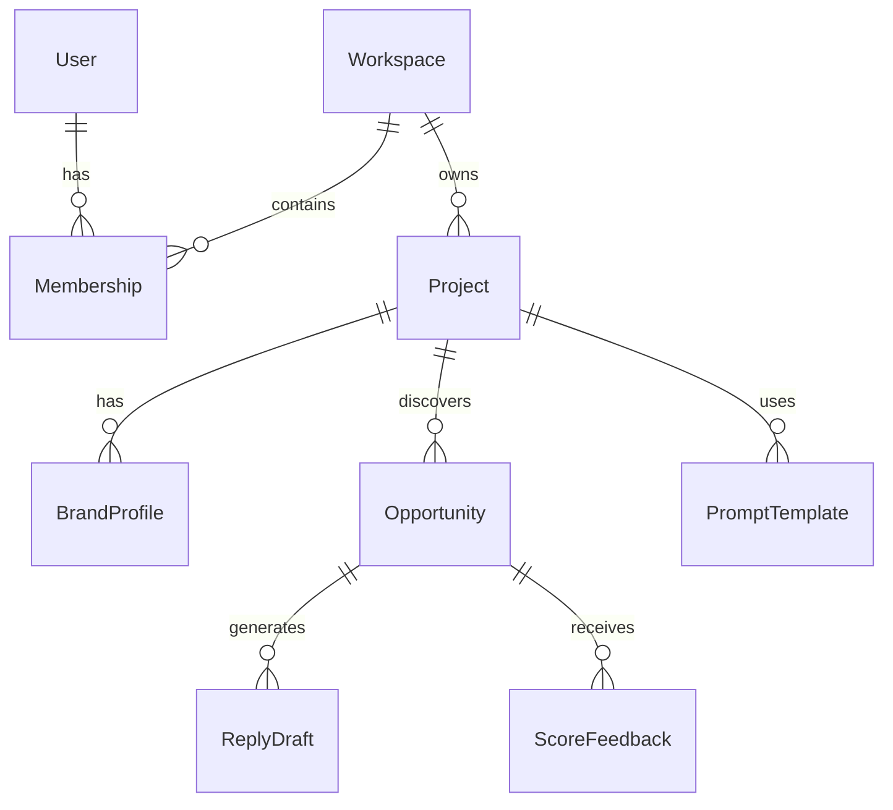

# Primitives

Foundational domain objects that appear across multiple systems.

## Overview

Primitives are the core data models that represent the fundamental concepts in Social AI Reply. These objects are used throughout the platform, from the database layer to the API responses.

## Core primitives

### [User and Workspace](user-workspace.md)
- User accounts and authentication
- Workspace organization and membership
- Multi-tenancy and access control

### [Project](project.md)
- Projects and campaigns
- Brand profiles and intelligence
- Prompt templates and configuration

### [Opportunity](opportunity.md)
- Social media opportunities
- Scoring and relevance
- Status tracking and workflow

## Primitive relationships



## Usage patterns

### Database layer
Primitives map to database tables and are accessed via table helpers.

```python
from app.db.tables.discovery import list_opportunities_for_project
from app.db.tables.projects import get_project_by_id
```

### API layer
Primitives are serialized to Pydantic models for API responses.

```python
from app.schemas.v1.projects import ProjectResponse
from app.schemas.v1.discovery import OpportunityResponse
```

### Service layer
Primitives are passed between services and agents.

```python
def process_opportunity(opportunity: dict):
    # opportunity is a primitive dict from database
    score = relevance_engine.score(opportunity)
    return {**opportunity, "score": score}
```

## Data types

### Dict-based
Most primitives are represented as `dict[str, Any]` in Python code.

### Pydantic models
API responses use Pydantic v2 models for validation and serialization.

### Database records
Primitives are stored as rows in Supabase Postgres tables.

## Configuration

### Table names
Table names are constants in table modules:
```python
OPPORTUNITIES_TABLE = "opportunities"
PROJECTS_TABLE = "projects"
```

### Schema versions
Some primitives have versioned schemas (e.g., `personas_v1`).

## Performance

### Caching
- Frequently accessed primitives are cached
- TTL-based expiration
- Cache invalidation on updates

### Indexing
- Primary keys for lookups
- Foreign keys for relationships
- Composite indexes for common queries

## Monitoring

### Data quality
- Validation constraints
- Required fields
- Type checking

### Usage metrics
- Query patterns
- Access frequency
- Storage growth

---

*360 Flatmates Platform Documentation*
