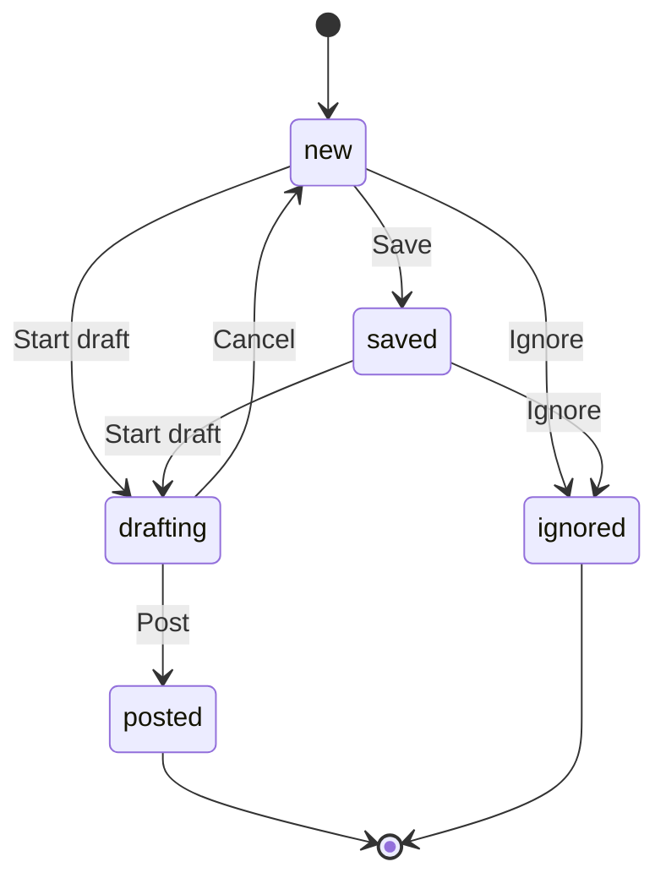

# Opportunity

Social media opportunities, scoring, relevance, status tracking, and workflow.

## Opportunity

### Fields
- `id` - Unique identifier
- `project_id` - Parent project
- `reddit_post_id` - Reddit post ID (if Reddit)
- `subreddit_name` - Subreddit name
- `title` - Post title
- `body_excerpt` - Post body excerpt
- `permalink` - Post URL
- `score` - Relevance score (0-100)
- `status` - new/saved/drafting/posted/ignored
- `reason_relevant` - Why it was kept
- `rejection_reason` - Why it was rejected (debug)
- `buying_stage` - Intent classification
- `created_at` - Discovery time
- `updated_at` - Last update time

### Purpose
- Represents a relevant social media post
- Scored by relevance engine
- Tracked through workflow
- Source for reply drafts

### Lifecycle
1. Agent discovers post
2. Relevance engine scores it
3. If kept, stored as opportunity
4. User reviews and selects
5. Draft generated
6. User edits and posts

## Status workflow



### Status meanings
- **new** - Just discovered, not reviewed
- **saved** - Bookmarked for later
- **drafting** - Reply draft in progress
- **posted** - Reply posted to Reddit
- **ignored** - Not relevant, dismissed

## Scoring

### Relevance score
- 0-100 scale
- Calculated by relevance engine
- Higher = more relevant
- Threshold: 70 (default)

### Score breakdown
- Keyword matches (25%)
- Semantic similarity (30%)
- Intent classification (20%)
- Pain point detection (10%)
- Source fit (10%)
- Freshness (5%)

### Explanations
- `reason_relevant` - Why it passed threshold
- `rejection_reason` - Why it failed (debug mode)

## Buying stage

### Intent classification
- **awareness** - Problem aware
- **consideration** - Solution seeking
- **decision** - Ready to buy
- **retention** - Existing customer

### Stage detection
- Heuristic rules
- Keyword patterns
- Optional LLM refinement

## Usage patterns

### Listing opportunities
```python
from app.db.tables.discovery import list_opportunities_for_project

opportunities = list_opportunities_for_project(
    supabase, 
    project_id, 
    status="new",
    limit=50
)
```

### Updating status
```python
from app.db.tables.discovery import update_opportunity

update_opportunity(supabase, opportunity_id, {
    "status": "saved"
})
```

### Getting scored opportunities
```python
from app.services.product.relevance_v2 import RelevanceEngine

engine = RelevanceEngine()
scored = engine.score_opportunities(opportunities)
```

## Database tables

- `opportunities` - Main opportunity records
- `score_feedback` - User feedback on scores

## API endpoints

- `GET /v1/opportunities` - List opportunities
- `GET /v1/opportunities/{id}` - Get opportunity
- `PUT /v1/opportunities/{id}` - Update opportunity
- `POST /v1/opportunities/{id}/save` - Save opportunity
- `POST /v1/opportunities/{id}/ignore` - Ignore opportunity

## Performance

### Indexes
- Project ID index
- Status index
- Score index
- Created_at index

### Query optimization
- Filter by status
- Order by score or date
- Pagination with range

## Monitoring

### Metrics
- Opportunities per run
- Score distribution
- Status transitions
- Conversion rates

### Alerts
- Low opportunity count
- High rejection rate
- Score anomalies

## Relationships

### To project
- Opportunities belong to projects
- Project scope for discovery
- Brand profile influences scoring

### To agents
- Agents discover opportunities
- Different agents find different types
- Central feed aggregates all

### To drafts
- Opportunities generate drafts
- Drafts link back to opportunities
- Status tracks workflow

---

*360 Flatmates Platform Documentation*
