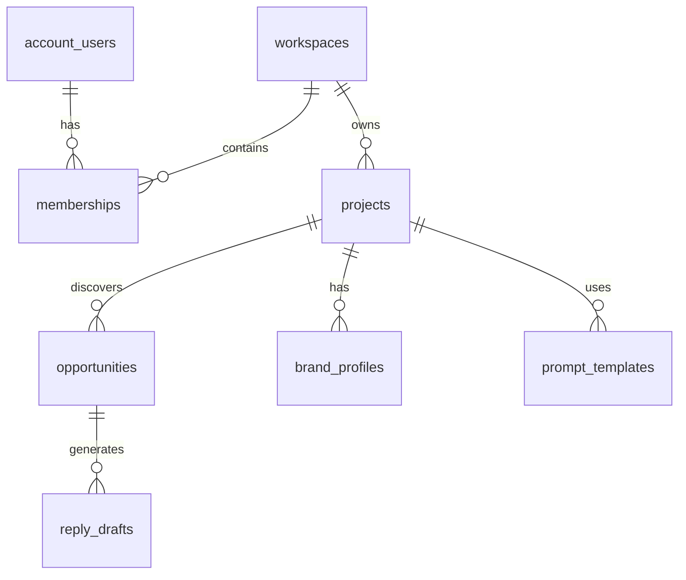

# Data models

Database schema, Pydantic models, and type definitions for Social AI Reply.

## Database schema

### Core tables

#### account_users
```sql
CREATE TABLE account_users (
  id UUID PRIMARY KEY DEFAULT gen_random_uuid(),
  email TEXT UNIQUE NOT NULL,
  name TEXT,
  created_at TIMESTAMPTZ DEFAULT NOW(),
  updated_at TIMESTAMPTZ DEFAULT NOW()
);
```

#### workspaces
```sql
CREATE TABLE workspaces (
  id SERIAL PRIMARY KEY,
  name TEXT NOT NULL,
  slug TEXT UNIQUE NOT NULL,
  created_at TIMESTAMPTZ DEFAULT NOW(),
  updated_at TIMESTAMPTZ DEFAULT NOW()
);
```

#### projects
```sql
CREATE TABLE projects (
  id SERIAL PRIMARY KEY,
  workspace_id INTEGER REFERENCES workspaces(id),
  name TEXT NOT NULL,
  slug TEXT UNIQUE NOT NULL,
  description TEXT,
  status TEXT DEFAULT 'active',
  created_at TIMESTAMPTZ DEFAULT NOW(),
  updated_at TIMESTAMPTZ DEFAULT NOW()
);
```

#### opportunities
```sql
CREATE TABLE opportunities (
  id SERIAL PRIMARY KEY,
  project_id INTEGER REFERENCES projects(id),
  reddit_post_id TEXT,
  subreddit_name TEXT,
  title TEXT NOT NULL,
  body_excerpt TEXT,
  permalink TEXT,
  score INTEGER DEFAULT 0,
  status TEXT DEFAULT 'new',
  reason_relevant TEXT,
  rejection_reason TEXT,
  buying_stage TEXT,
  created_at TIMESTAMPTZ DEFAULT NOW(),
  updated_at TIMESTAMPTZ DEFAULT NOW()
);
```

### Relationships



## Pydantic models

### Response models

#### ProjectResponse
```python
from datetime import datetime
from pydantic import BaseModel, ConfigDict, Field

class ProjectResponse(BaseModel):
    model_config = ConfigDict(from_attributes=True)
    
    id: int
    workspace_id: int
    name: str = Field(min_length=2, max_length=255)
    slug: str
    description: str | None
    status: str
    created_at: datetime
    updated_at: datetime
```

#### OpportunityResponse
```python
class OpportunityResponse(BaseModel):
    model_config = ConfigDict(from_attributes=True)
    
    id: int
    project_id: int
    reddit_post_id: str | None
    subreddit_name: str | None
    title: str
    body_excerpt: str | None
    permalink: str | None
    score: int
    status: str
    reason_relevant: str | None
    rejection_reason: str | None
    buying_stage: str | None
    created_at: datetime
    updated_at: datetime
```

### Request models

#### ProjectCreateRequest
```python
class ProjectCreateRequest(BaseModel):
    name: str = Field(min_length=2, max_length=255)
    description: str | None = Field(default=None, max_length=4000)
```

#### OpportunityUpdateRequest
```python
class OpportunityUpdateRequest(BaseModel):
    status: str = Field(pattern="^(new|saved|drafting|posted|ignored)$")
```

## Type definitions

### Python types

```python
from typing import Any

# Database records
Record = dict[str, Any]
RecordList = list[Record]

# API responses
Response = dict[str, Any]
ResponseList = list[Response]

# Configuration
Settings = dict[str, str | int | bool]
```

### TypeScript types

```typescript
// API responses
interface Project {
  id: number;
  workspace_id: number;
  name: string;
  slug: string;
  description: string | null;
  status: string;
  created_at: string;
  updated_at: string;
}

interface Opportunity {
  id: number;
  project_id: number;
  title: string;
  score: number;
  status: string;
  created_at: string;
}
```

## Validation

### Pydantic validation

```python
# Field constraints
name: str = Field(min_length=2, max_length=255)
score: int = Field(ge=0, le=100)
status: str = Field(pattern="^(active|archived)$")

# Model validation
@model_validator(mode="after")
def validate_settings(self) -> "Settings":
    if self.environment == "production" and not self.supabase_url:
        raise ValueError("SUPABASE_URL required")
    return self
```

### Database constraints

```sql
-- Unique constraints
UNIQUE(email)
UNIQUE(slug)

-- Foreign keys
REFERENCES workspaces(id)
REFERENCES projects(id)

-- Check constraints
CHECK (status IN ('new', 'saved', 'drafting', 'posted', 'ignored'))
```

## Schema migrations

### Migration files

Located in `app/db/migrations/`:
- `001_multi_agent_platform.sql` - Initial schema
- `202606*.sql` - Feature migrations

### Applying migrations

Run SQL in Supabase SQL Editor or via CLI.

## Data types

### UUID
- Primary keys for user-related tables
- Generated automatically
- Used for Supabase Auth integration

### SERIAL
- Primary keys for application tables
- Auto-incrementing integers
- Used for performance

### TIMESTAMPTZ
- Timestamps with timezone
- Always UTC storage
- Used for all time fields

### TEXT
- Variable-length strings
- No maximum length in PostgreSQL
- Used for most text fields

### INTEGER
- Whole numbers
- Used for scores, counts, IDs

### BOOLEAN
- True/false values
- Used for flags and settings

## Performance

### Indexes

```sql
-- Primary keys (automatic)
CREATE UNIQUE INDEX idx_account_users_id ON account_users(id);

-- Foreign keys
CREATE INDEX idx_projects_workspace_id ON projects(workspace_id);
CREATE INDEX idx_opportunities_project_id ON opportunities(project_id);

-- Frequently queried fields
CREATE INDEX idx_opportunities_status ON opportunities(status);
CREATE INDEX idx_opportunities_score ON opportunities(score);
```

### Query optimization

- Use specific selects instead of `*`
- Add indexes for frequent queries
- Use range for pagination
- Avoid N+1 queries

## Monitoring

### Data quality

- Validation constraints
- Required fields
- Type checking
- Referential integrity

### Usage metrics

- Table sizes
- Query patterns
- Index usage
- Growth trends

---

*360 Flatmates Platform Documentation*
