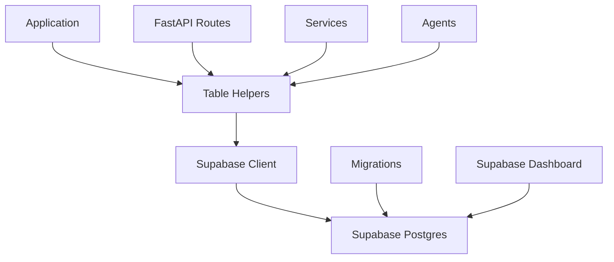

# Database

Supabase Postgres data layer with typed table operations and migrations.

## Purpose

The database system provides persistent storage for all platform data using Supabase Postgres. It uses the Supabase Python SDK for all operations, with typed table helpers organized by domain.

## Architecture



## Key abstractions

| Component | Location | Purpose |
|-----------|----------|---------|
| `supabase_client.py` | `app/db/supabase_client.py` | Singleton client |
| `tables/*.py` | `app/db/tables/` | Domain-specific operations |
| `schema_v2.sql` | `app/db/schema_v2.sql` | Database schema |
| `migrations/` | `app/db/migrations/` | Schema migrations |

## Table organization

### Domain tables
- **users** - Account users and profiles
- **workspaces** - Workspaces and memberships
- **projects** - Projects and brand profiles
- **discovery** - Opportunities, personas, keywords
- **content** - Reply drafts, post drafts
- **visibility** - Prompt sets, AI responses, citations
- **analytics** - Snapshots, audit events
- **agents** - Agent runs and schedules

## Client usage

### Singleton pattern
```python
from app.db.supabase_client import get_supabase_client

client = get_supabase_client()  # Returns singleton
```

### FastAPI dependency
```python
from supabase import Client
from fastapi import Depends
from app.db.supabase_client import get_supabase

@router.get("/items")
def list_items(supabase: Client = Depends(get_supabase)):
    result = supabase.table("items").select("*").execute()
    return result.data
```

## Query patterns

### Select
```python
# Single record
result = db.table("projects").select("*").eq("id", project_id).execute()
project = result.data[0] if result.data else None

# List with filter
result = (
    db.table("opportunities")
    .select("*")
    .eq("project_id", pid)
    .eq("status", "new")
    .execute()
)
```

### Insert
```python
result = db.table("projects").insert({
    "workspace_id": workspace_id,
    "name": "My Project",
    "slug": "my-project"
}).execute()
project = result.data[0]
```

### Update
```python
result = (
    db.table("workspaces")
    .update({"name": "New Name"})
    .eq("id", workspace_id)
    .execute()
)
```

### Delete
```python
db.table("invitations").delete().eq("id", invitation_id).execute()
```

### Advanced queries
```python
# IN clause
result = db.table("workspaces").select("*").in_("id", [1, 2, 3]).execute()

# Count
result = (
    db.table("opportunities")
    .select("id", count="exact")
    .eq("project_id", pid)
    .execute()
)
count = result.count

# Ordering and pagination
result = (
    db.table("personas")
    .select("*")
    .eq("project_id", pid)
    .order("created_at", desc=True)
    .range(0, 9)  # First 10 records
    .execute()
)
```

## Table helpers

### Naming convention
```python
def get_<entity>_by_id(db: Client, id: int) -> dict[str, Any] | None: ...
def list_<entities>_for_<parent>(db: Client, parent_id: int) -> list[dict[str, Any]]: ...
def create_<entity>(db: Client, data: dict[str, Any]) -> dict[str, Any]: ...
def update_<entity>(db: Client, id: int, data: dict[str, Any]) -> dict[str, Any] | None: ...
def delete_<entity>(db: Client, id: int) -> None: ...
```

### Example
```python
# app/db/tables/discovery.py
def list_opportunities_for_project(
    db: Client, 
    project_id: int, 
    limit: int = 100
) -> list[dict[str, Any]]:
    result = (
        db.table("opportunities")
        .select("*")
        .eq("project_id", project_id)
        .order("created_at", desc=True)
        .range(0, limit - 1)
        .execute()
    )
    return list(result.data)
```

## Migrations

### Migration files
Located in `app/db/migrations/`:
- `001_multi_agent_platform.sql` - Initial schema
- `202606*.sql` - Recent feature migrations

### Applying migrations
Run SQL in Supabase SQL Editor or via CLI.

## Performance

### Connection pooling
- Supabase handles connection pooling
- HTTP/1.1 forced to avoid stale connections
- Singleton client per process

### Query optimization
- Use specific selects instead of `*`
- Add indexes for frequent queries
- Use range for pagination

## Monitoring

### Health checks
```python
# Database connectivity
result = db.table("account_users").select("id").limit(1).execute()
```

### Logging
- Query logging in development
- Performance metrics
- Error tracking

## Backup and recovery

### Supabase backups
- Automatic daily backups
- Point-in-time recovery
- Manual backup via dashboard

### Data export
- Export via Supabase dashboard
- SQL dump for full backup
- API for partial export

---

*360 Flatmates Platform Documentation*
