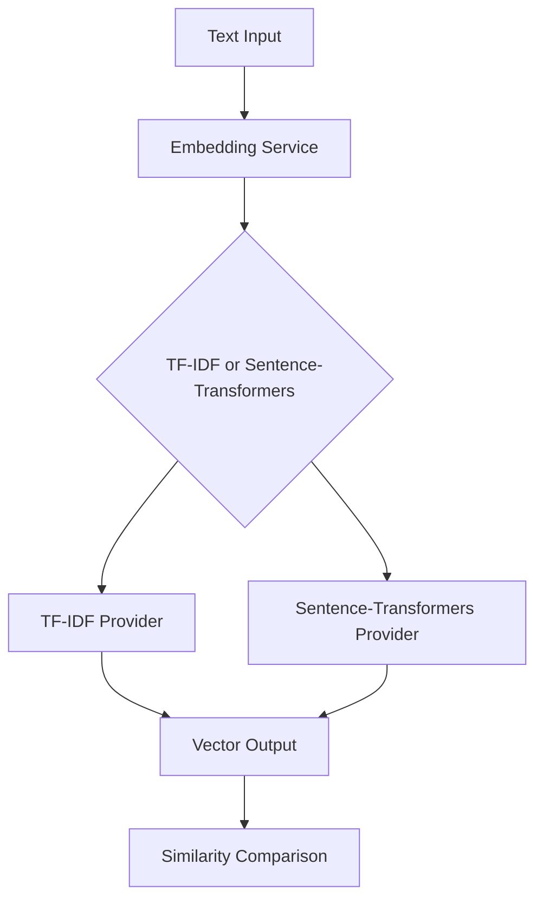

# Embeddings

Local text embedding service using TF-IDF and optional sentence-transformers.

## Purpose

The embedding service converts text into numerical vectors for semantic similarity comparison. It enables the relevance engine to understand meaning beyond exact keyword matches.

## Architecture



## Key abstractions

| Component | Location | Purpose |
|-----------|----------|---------|
| `EmbeddingService` | `app/services/infrastructure/embeddings/` | Main service |
| `TfidfProvider` | `app/services/infrastructure/embeddings/` | TF-IDF implementation |
| `SentenceTransformersProvider` | `app/services/infrastructure/embeddings/` | Neural embeddings |

## Providers

### TF-IDF (default)
- **File**: `tfidf_provider.py`
- **Model**: scikit-learn TF-IDF
- **Pros**: Fast, no model download, works offline
- **Cons**: Less accurate for semantic similarity

### Sentence-transformers (optional)
- **File**: `sentence_transformers_provider.py`
- **Model**: `all-MiniLM-L6-v2`
- **Pros**: Better semantic understanding
- **Cons**: Requires ~50MB model download, slower

## Usage

### Basic embedding
```python
from app.services.infrastructure.embeddings.service import EmbeddingService

service = EmbeddingService()
vector = service.embed("This is a sample text")
```

### Similarity comparison
```python
from app.services.infrastructure.embeddings.service import EmbeddingService

service = EmbeddingService()
similarity = service.pairwise_similarity(
    "Need help with FastAPI",
    "Building REST APIs in Python"
)
print(similarity)  # 0.85
```

### Batch embedding
```python
vectors = service.embed_batch([
    "First text",
    "Second text",
    "Third text"
])
```

## Configuration

### Environment variables
```bash
# Embedding model selection
EMBEDDING_MODEL=tfidf  # or "sentence-transformers"

# Sentence-transformers settings
SENTENCE_TRANSFORMERS_MODEL=all-MiniLM-L6-v2
```

### Constructor arguments
TF-IDF settings are configured via constructor arguments, not environment variables:
```python
service = EmbeddingService(
    provider="tfidf",
    max_features=10000,
    ngram_range=(1, 2)  # Python tuple, not env var
)
```

### Provider selection
```python
from app.services.infrastructure.embeddings.service import EmbeddingService

# Use TF-IDF (default)
service = EmbeddingService(provider="tfidf")

# Use sentence-transformers
service = EmbeddingService(provider="sentence-transformers")
```

## Performance

### Speed
- **TF-IDF**: 1-10ms per text
- **Sentence-transformers**: 10-100ms per text

### Memory
- **TF-IDF**: ~10MB
- **Sentence-transformers**: ~50MB

### Accuracy
- **TF-IDF**: Good for exact matches, limited semantics
- **Sentence-transformers**: Better semantic understanding

## Caching

### In-memory cache
- Caches embeddings for repeated texts
- Reduces computation for common queries
- TTL-based expiration

### Cache configuration
```python
EMBEDDING_CACHE_TTL=300  # 5 minutes
EMBEDDING_CACHE_SIZE=1000  # Maximum entries
```

## Use cases

### Opportunity scoring
- Compare post text with brand keywords
- Calculate semantic relevance
- Filter by similarity threshold

### Duplicate detection
- Find similar posts across runs
- Deduplicate opportunities
- Merge related discussions

### Content matching
- Match articles to opportunities
- Find related content
- Suggest similar discussions

## Limitations

### TF-IDF limitations
- No understanding of word order
- Limited synonym handling
- Bag-of-words approach

### Sentence-transformers limitations
- Requires model download
- Higher memory usage
- Slower inference

### General limitations
- English-only by default
- Fixed vector dimensions
- No incremental learning

## Monitoring

### Performance metrics
- Embedding latency
- Cache hit rate
- Memory usage

### Quality metrics
- Similarity score distribution
- Threshold effectiveness
- User feedback correlation

---

*360 Flatmates Platform Documentation*
