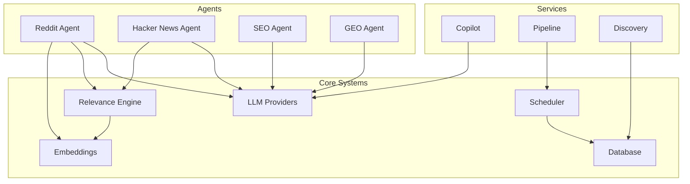

# Systems

Backend infrastructure components that provide technical foundations for the platform.

## Overview

The systems layer contains the technical infrastructure that powers Social AI Reply. These components provide core capabilities like LLM integration, scheduling, scoring, and data management.

## Core systems

### [LLM Providers](llm-providers.md)
Modular provider system for AI language models (Gemini, OpenAI, Claude, Perplexity, Ollama).

### [Scheduler](scheduler.md)
Orchestrates agent runs on manual, daily, or cron schedules.

### [Relevance Engine](relevance-engine.md)
Weighted scoring algorithm for evaluating opportunity relevance.

### [Embeddings](embeddings.md)
Local text embedding service using TF-IDF and optional sentence-transformers.

### [Database](database.md)
Supabase Postgres data layer with typed table operations.

## System relationships



## Design principles

### Modularity
Each system has clear boundaries and responsibilities. Systems communicate through well-defined interfaces.

### Configurability
Systems support multiple backends and configurations. For example, LLM providers can be swapped without code changes.

### Fault tolerance
Systems degrade gracefully when dependencies are unavailable. For example, the template LLM provider works without API keys.

### Observability
Systems provide logging, metrics, and health checks for monitoring and debugging.

## Configuration

### Environment variables
Each system has its own configuration variables. See individual system pages for details.

### Runtime configuration
Some systems support runtime configuration changes without restart.

### Defaults
Systems have sensible defaults for development and testing.

## Monitoring

### Health checks
```bash
# System health
curl http://localhost:8000/health

# Individual system status
curl http://localhost:8000/ready
```

### Logging
Structured JSON logging for all systems. Logs include system name, operation, and timing.

### Metrics
Performance metrics for system operations:
- LLM call duration and token usage
- Scheduler run success rates
- Relevance scoring distribution
- Database query performance

## Troubleshooting

### Common issues
- **LLM not configured** - Check API keys in `.env`
- **Scheduler not running** - Check background tasks
- **Embeddings slow** - Check model loading
- **Database connection** - Check Supabase credentials

### Debug mode
Enable debug logging for detailed system information:
```bash
LOG_LEVEL=DEBUG uv run uvicorn app.main:app --reload
```

---

*360 Flatmates Platform Documentation*
