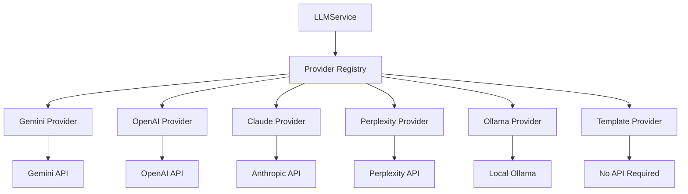

# LLM Providers

Modular provider system for AI language models with pluggable backends.

## Purpose

The LLM provider system abstracts AI language model interactions behind a unified interface. It supports multiple providers (Gemini, OpenAI, Claude, Perplexity, Ollama) with automatic fallback to a template provider when no API keys are configured.

## Architecture



## Key abstractions

| Component | Location | Purpose |
|-----------|----------|---------|
| `LLMService` | `app/services/infrastructure/llm/service.py` | Single-provider facade |
| `VisibilityRunner` | `app/services/infrastructure/llm/service.py` | Multi-provider facade |
| `LLMProvider` | `app/services/infrastructure/llm/base.py` | Provider protocol |
| `_registry.py` | `app/services/infrastructure/llm/providers/` | Provider registration |

## Provider details

### Gemini (default)
- **File**: `providers/gemini_provider.py`
- **API Key**: `GEMINI_API_KEY`
- **Model**: `gemini-2.0-flash`
- **Strengths**: Fast, good quality, free tier available

### OpenAI
- **File**: `providers/openai_provider.py`
- **API Key**: `OPENAI_API_KEY`
- **Model**: `gpt-4o-mini`
- **Strengths**: High quality, supports custom base URL

### Claude
- **File**: `providers/claude_provider.py`
- **API Key**: `ANTHROPIC_API_KEY`
- **Model**: `claude-3-haiku-20240307`
- **Strengths**: Excellent reasoning, long context

### Perplexity
- **File**: `providers/perplexity_provider.py`
- **API Key**: `PERPLEXITY_API_KEY`
- **Model**: `llama-3.1-sonar-small-128k-online`
- **Strengths**: Web search integration

### Ollama
- **File**: `providers/ollama_provider.py`
- **Base URL**: `OLLAMA_BASE_URL`
- **Model**: Configurable
- **Strengths**: Local, no API costs, privacy

### Template (fallback)
- **File**: `providers/template_provider.py`
- **API Key**: None required
- **Strengths**: Works offline, zero cost

## Usage

### Single provider (LLMService)
```python
from app.services.infrastructure.llm.service import LLMService

llm = LLMService()  # Uses default provider
response = llm.call_text("Explain quantum computing")
```

### Multi-provider (VisibilityRunner)
```python
from app.services.infrastructure.llm.service import VisibilityRunner

runner = VisibilityRunner()
responses = runner.run_all("What is AI?", ["gemini", "openai", "claude"])
```

## Configuration

### Environment variables
```bash
# Provider selection
LLM_PROVIDER=gemini  # Default

# Provider API keys
GEMINI_API_KEY=your_key
OPENAI_API_KEY=your_key
ANTHROPIC_API_KEY=your_key
PERPLEXITY_API_KEY=your_key

# Ollama configuration
OLLAMA_BASE_URL=http://localhost:11434

# OpenAI-compatible endpoints
OPENAI_BASE_URL=https://your-endpoint.com/v1
```

### Adding a new provider
1. Create `providers/new_provider.py`
2. Implement `LLMProvider` protocol
3. Register in `providers/_registry.py`
4. Add API key env var to `_PROVIDER_API_KEY_ENV`

## Performance

### Latency
- **Gemini**: 1-3 seconds
- **OpenAI**: 2-5 seconds
- **Claude**: 2-4 seconds
- **Perplexity**: 3-6 seconds
- **Ollama**: 1-10 seconds (depends on model)
- **Template**: <1 second

### Token usage
- Tracks request and response tokens
- Logs usage per provider
- No built-in rate limiting (provider-specific)

## Error handling

### Provider failures
- Automatic fallback to template provider
- Structured error responses
- Detailed logging

### API key issues
- Clear error messages
- Startup warnings for missing keys
- Graceful degradation

## Monitoring

### Health checks
```python
from app.services.infrastructure.llm.providers._registry import get_configured_providers

providers = get_configured_providers()
print(f"Configured providers: {list(providers.keys())}")
```

### Logging
- Provider name and model
- Request/response tokens
- Latency measurements
- Error details

---

*360 Flatmates Platform Documentation*
