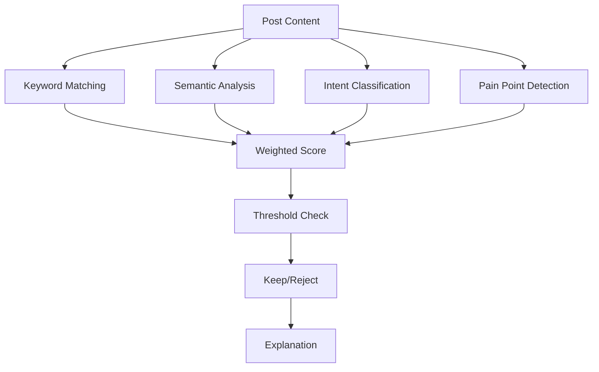

# Relevance Engine

Weighted scoring algorithm for evaluating opportunity relevance with transparent explanations.

## Purpose

The relevance engine determines how relevant a social media post is to your brand. It uses a transparent weighted formula that considers multiple factors, providing clear explanations for why opportunities are kept or rejected.

## Scoring formula

All component scores are normalized to a 0-100 scale before weighting. The final score is a weighted sum:

```python
base_score = keyword_score * 0.25
           + semantic_score * 0.30
           + intent_score * 0.20
           + pain_point_score * 0.10
           + source_fit_score * 0.10
           + freshness_score * 0.05
           - penalties
```

### Weight breakdown

| Factor | Weight | Range | Description |
|--------|--------|-------|-------------|
| Semantic similarity | 30% | 0-100 | How well the text matches your keywords (TF-IDF similarity scaled to 0-100) |
| Keywords | 25% | 0-100 | Direct keyword matches |
| Intent | 20% | 0-100 | Buying intent and relevance |
| Pain points | 10% | 0-100 | Customer problem indicators |
| Source fit | 10% | 0-100 | Platform and subreddit relevance |
| Freshness | 5% | 0-100 | How recent the post is |

## Architecture



## Key abstractions

| Component | Location | Purpose |
|-----------|----------|---------|
| `RelevanceEngine` | `app/services/product/relevance_v2.py` | Main scoring engine |
| `CandidatePost` | `app/services/product/relevance_v2.py` | Post data structure |
| `EmbeddingService` | `app/services/infrastructure/embeddings/` | Semantic similarity |

## Scoring factors

### Keyword matching (25%)
- Direct keyword matches in title and body
- Weighted by keyword importance
- Multiple matches increase score

### Semantic similarity (30%)
- TF-IDF vector comparison
- Contextual meaning matching
- Handles synonyms and related terms

### Intent classification (20%)
- Buying intent signals
- Question indicators
- Problem statement detection

### Pain point detection (10%)
- Customer problem identification
- Frustration language
- Need expressions

### Source fit (10%)
- Subreddit relevance
- Community fit
- Platform appropriateness

### Freshness (5%)
- Post age weighting
- Recent posts score higher
- Decays over time

## Threshold rules

A post is **kept** only if:
- `relevance_score >= 70`
- `semantic_similarity >= 0.45`
- At least 2 meaningful keyword matches OR strong semantic match
- Intent is not spam/unsafe/irrelevant
- Post is not a job posting (unless recruiting-related)
- Post is not too old (>180 days)

## Explanations

### Kept posts
Every kept post includes `reason_relevant` explaining why it passed.

### Rejected posts
In debug mode, rejected posts include `rejection_reason` explaining why they failed.

## Usage

### Programmatic
```python
from app.services.product.relevance_v2 import RelevanceEngine

engine = RelevanceEngine()
result = engine.score_post(
    title="Need help with FastAPI",
    body="I'm building a REST API...",
    keywords=["python", "fastapi"],
    subreddit="r/Python"
)

print(result.score)  # 85
print(result.reason_relevant)  # "Strong semantic match + keyword matches"
```

### In agents
```python
# Reddit Agent uses relevance engine
agent = RedditAgent()
opportunities = agent.run(company_id=1)
# Opportunities are pre-filtered by relevance engine
```

## Configuration

### Thresholds
```python
RELEVANCE_THRESHOLD = 70  # Minimum score to keep
SEMANTIC_THRESHOLD = 0.45  # Minimum semantic similarity
MAX_POST_AGE_DAYS = 180  # Maximum post age
```

### Weights
Weights are configurable but default to the formula above.

## Performance

### Scoring speed
- **Per post**: 1-5 milliseconds
- **Batch scoring**: 100 posts in 1-2 seconds

### Accuracy
- **Precision**: 80-90% (kept posts are relevant)
- **Recall**: 70-80% (finds most relevant posts)

## Tuning

### Feedback loop
The system learns from user feedback:
- Approve/reject actions adjust keyword weights
- Score feedback calibrates future scoring
- Personalized per company over time

### Manual adjustments
- Adjust thresholds in configuration
- Modify weight factors
- Add custom rejection rules

---

*360 Flatmates Platform Documentation*
