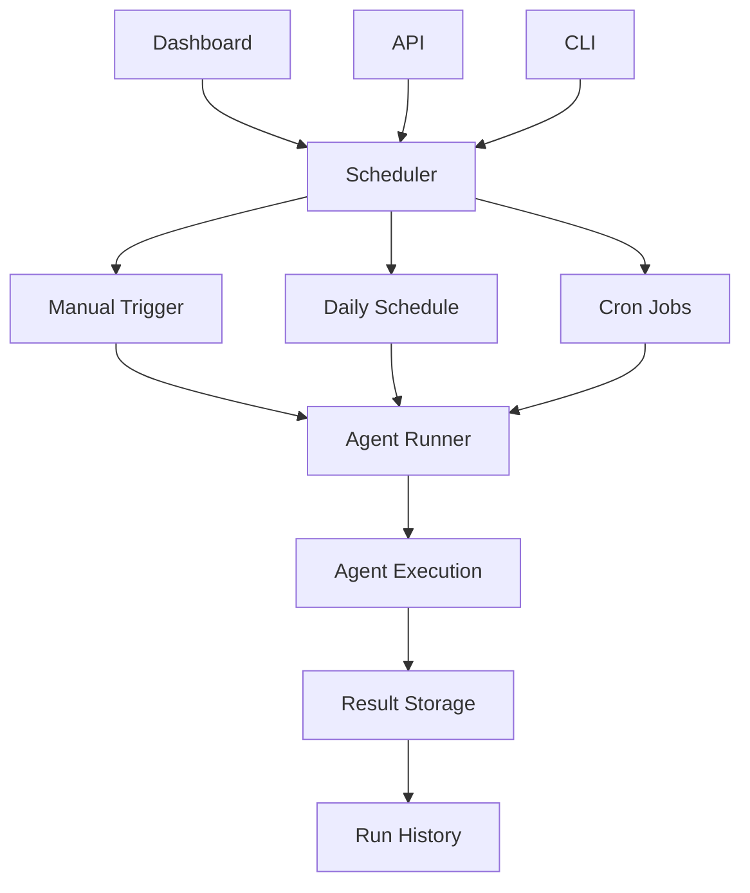
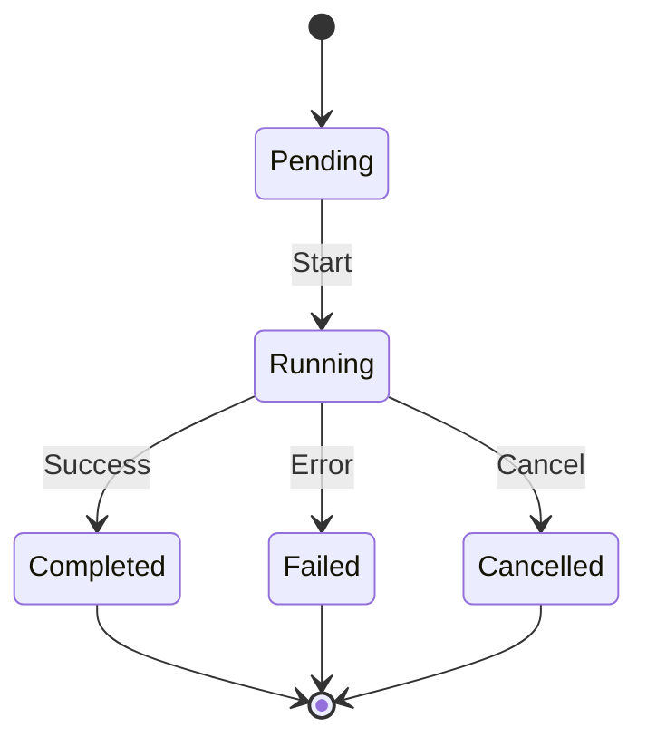

# Scheduler

Orchestrates agent runs on manual, daily, or cron schedules with run tracking.

## Purpose

The scheduler manages agent execution, providing both manual triggering and automated scheduling. It tracks all agent runs, stores results, and coordinates agent lifecycle.

## Architecture



## Key abstractions

| Component | Location | Purpose |
|-----------|----------|---------|
| `Scheduler` | `app/services/infrastructure/scheduler/` | Main orchestrator |
| `AgentRunner` | `app/services/infrastructure/scheduler/` | Agent execution |
| `RunTracker` | `app/services/infrastructure/scheduler/` | Run history management |

## Scheduling modes

### Manual runs
- Triggered from dashboard or API
- Immediate execution
- Useful for testing and one-off runs

### Daily schedule
- Runs once per day at configured time
- All agents or specific agents
- Configurable per company

### Cron jobs
- Custom scheduling via cron expressions
- Flexible timing patterns
- Advanced use cases

## Agent execution

### Run lifecycle


### Run metadata
- `agent_name` - Which agent ran
- `company_id` - Company context
- `started_at` - Execution start time
- `completed_at` - Execution end time
- `status` - Final status (completed/failed/cancelled)
- `metrics` - Performance data

## Usage

### Manual trigger (API)
```bash
POST /v1/agents/run
{
  "agent_name": "reddit",
  "company_id": 1
}
```

### Manual trigger (dashboard)
1. Go to Agent Runs page
2. Select agent
3. Click "Run"

### Daily schedule (configuration)
```python
# In company settings
daily_schedule = {
    "enabled": True,
    "time": "09:00",
    "timezone": "UTC",
    "agents": ["reddit", "hackernews"]
}
```

### Cron jobs (CLI)
```bash
# Run all agents
python -m app.services.infrastructure.scheduler.cli --company-id 1 --run-all

# Run specific agent
python -m app.services.infrastructure.scheduler.cli --company-id 1 --agent reddit
```

## Run tracking

### Run history
- Complete audit trail of all agent runs
- Success/failure metrics
- Performance trends

### Dashboard views
- Recent runs list
- Run details with logs
- Success rate charts
- Performance metrics

## Configuration

### Environment variables
- `SCHEDULER_ENABLED` - Enable/disable scheduler
- `SCHEDULER_TIMEZONE` - Default timezone
- `MAX_CONCURRENT_RUNS` - Limit parallel runs

### Company settings
- Daily schedule time
- Enabled agents
- Notification preferences

## Performance

### Throughput
- **Manual runs**: Immediate execution
- **Daily runs**: Batch execution at scheduled time
- **Concurrent runs**: Configurable limit

### Resource usage
- Background task execution
- Database connection pooling
- Memory usage per agent

## Error handling

### Failed runs
- Automatic retry (configurable)
- Error logging and reporting
- Notification on failure

### Timeout handling
- Per-agent timeout configuration
- Graceful cancellation
- Resource cleanup

## Monitoring

### Health checks
```bash
# Scheduler status
curl http://localhost:8000/health

# Run history
curl http://localhost:8000/v1/agents/runs
```

### Metrics
- Run success rates
- Average execution time
- Agent performance trends

---

*360 Flatmates Platform Documentation*
